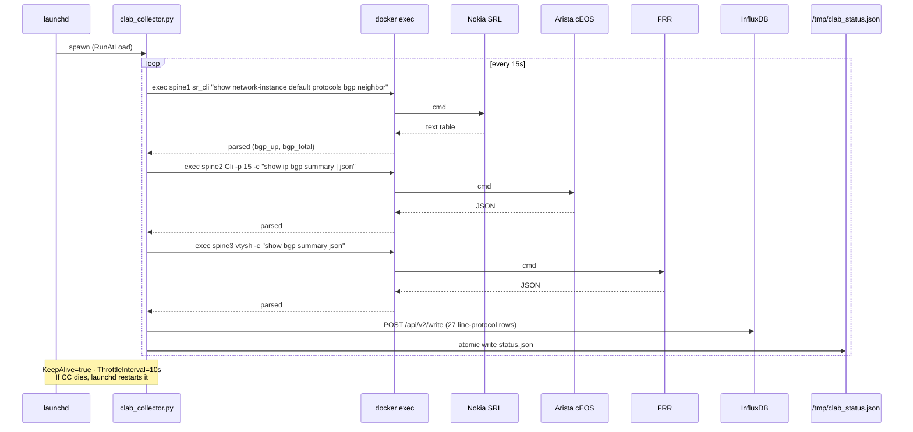
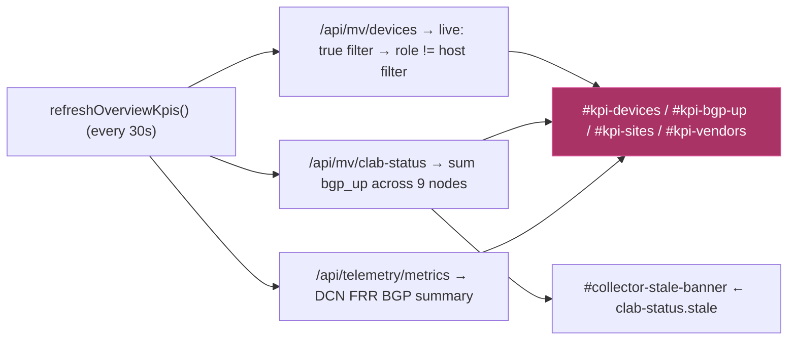
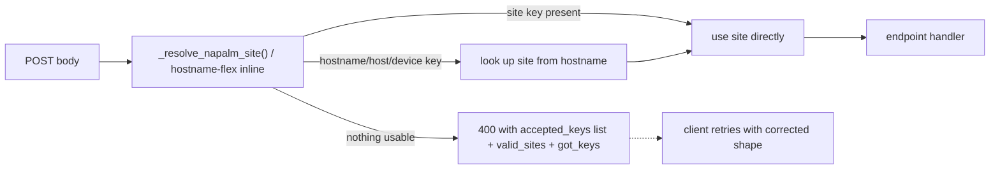
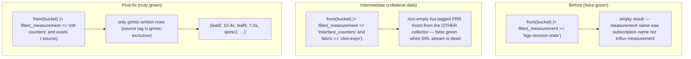

# DCN Network Tool — Architecture (Post-Audit, 2026-05-25)

This document is the post-audit reference architecture for the tool after the
2026-05-25 functional audit and hardening pass. It supersedes earlier
diagrams that showed the pre-fix state with two duplicate collectors and an
unsupervised collector daemon.

## 1. Component map

```mermaid
graph TB
    classDef live   fill:#0d2,stroke:#0a0,color:#fff
    classDef infra  fill:#246,stroke:#48a,color:#fff
    classDef ui     fill:#a36,stroke:#d59,color:#fff
    classDef ai     fill:#532,stroke:#a64,color:#fff
    classDef dep    fill:#444,stroke:#888,color:#bbb,stroke-dasharray:4

    subgraph "Live Topology — 25 deployed containers, 19 network devices"
        direction LR
        subgraph "DCN Lab (10 FRR · sites: DE-FRA · UK-LON · NL-AMS · US-NYC)"
            DCN1[de-fra-core-01]:::live
            DCN2[de-fra-core-02]:::live
            DCN3[uk-lon-core-01]:::live
            DCN4["...10 routers · BGP/OSPF mesh"]:::live
        end
        subgraph "Clos-EVPN Fabric (CLAB-DC1 · 9 routing + 6 hosts)"
            S1[spine1 SRL]:::live
            S2[spine2 cEOS]:::live
            S3[spine3 FRR]:::live
            L1["leaf1-6 (3 cEOS · 2 SRL · 1 FRR)"]:::live
            HOST["host1-6 Linux · test traffic"]:::live
        end
    end

    subgraph "Telemetry Layer"
        gnmic["clab-gnmic sidecar :7890<br/>3 SRL targets · ON_CHANGE + SAMPLE"]:::infra
        FRRtel["frr-telemetry container<br/>polls 10 DCN FRR routers"]:::infra
        clab["clab_collector.py (launchd KeepAlive)<br/>polls 9 clab routing nodes"]:::infra
        old["telemetry-collector.py<br/>.deprecated-2026-05-25"]:::dep
    end

    subgraph "Data Layer"
        INF[(InfluxDB :8086<br/>network-telemetry bucket)]:::infra
        netlog["netlog-ai :6060<br/>RAG over sanitized configs"]:::infra
        GRAF[Grafana :3000<br/>2 dashboards]:::infra
    end

    subgraph "Application Layer"
        FLASK["Flask :5757<br/>156 endpoints"]:::ai
        DEMO["demo UI :8080<br/>live API wired"]:::ui
    end

    subgraph "AI/LLM"
        LLM["Qwen3 local → Claude Haiku fallback"]:::ai
        KEEP["/api/keep/correlate<br/>LLM correlation + netlog-ai RAG"]:::ai
    end

    S1 --> gnmic
    S2 -.-> clab
    S3 -.-> clab
    L1 -.-> clab
    DCN1 --> FRRtel
    DCN4 --> FRRtel

    gnmic --> INF
    FRRtel --> INF
    clab --> INF
    clab --> CSF[/tmp/clab_status.json]

    INF --> GRAF
    INF --> FLASK
    CSF --> FLASK
    netlog --> FLASK

    FLASK --> DEMO
    FLASK --> LLM
    FLASK --> KEEP
    KEEP --> netlog
    KEEP --> LLM
```

## 2. Single-source-of-truth invariant (post-audit)

Two pre-audit bugs broke this invariant:

1. **Duplicate collectors** — `clab_collector.py` and `telemetry-collector.py`
   both wrote to `interface_counters` with overlapping tag sets, producing
   double-counted data and conflicting freshness signals.
2. **Stale daemon** — `clab_collector.py` ran in an interactive shell as PID
   69685 for 5 days; source edits were ignored.

Post-audit invariants now enforced:

| Measurement | Sole writer | Cadence |
| --- | --- | --- |
| `bgp_session_count` / `ospf_neighbor_count` / `interface_count` | `clab_collector.py` (launchd) | 15s |
| `bgp_neighbor` / `interface_stats` (DCN-wide) | `frr-telemetry` container | 10s |
| `bgp-session-state` / `intf-counters` / `intf-oper-state` (SRL only) | `clab-gnmic` sidecar | ON_CHANGE + 10/15s |

Anything that *should* have one writer but appears with multiple writers in
`influx query distinct(_measurement)` is a regression.

## 3. Collector supervision



## 4. KPI strip data flow (post-fix)



Before the audit: KPIs counted ghost inventory (41 devices) and miscounted
BGP (28 up). Now they reflect the live-deployment truth: 19 / 87.

## 5. Endpoint param-flex pattern



7 endpoints used to demand `site` and return an opaque `"Unknown site: "` if
the caller sent `hostname`. The helper now accepts `site` / `hostname` /
`host` / `device` and tells the caller what to send when the lookup fails.

Same pattern applied to `target_device` / `hostname` / `device` on
`/api/mv/predict/run`, `/api/mv/forecast/predict`, `/api/mv/blast-radius/compute`.

## 6. gnmic freshness query — what changed



The `source` tag is set by gnmic itself and absent from every other
collector — it's the only reliable way to distinguish streaming-telemetry
freshness from polling-collector collateral writes.

## 7. Operational runbook

### Install supervisor (first time)

```bash
cp 04_Scripts_Tools/DCN_Network_Tool/network-lab/telemetry/com.geshlab.clab-collector.plist \
   ~/Library/LaunchAgents/com.geshlab.clab-collector.plist
launchctl load ~/Library/LaunchAgents/com.geshlab.clab-collector.plist
```

### After editing clab_collector.py

```bash
launchctl kickstart -k gui/$(id -u)/com.geshlab.clab-collector
tail -f /tmp/clab_collector.log
```

### Stop / start

```bash
launchctl unload  ~/Library/LaunchAgents/com.geshlab.clab-collector.plist
launchctl load    ~/Library/LaunchAgents/com.geshlab.clab-collector.plist
launchctl list | grep clab-collector   # PID column = 0 means stopped
```

### Verify the collector tick

```bash
curl -s http://localhost:5757/api/mv/clab-status | jq '.age_sec'   # expect < 30
curl -s http://localhost:5757/api/mv/clab-status | jq '.stale'     # expect false
```

If `age_sec` exceeds 60 the UI auto-surfaces a yellow banner — that's the
heartbeat detection that was missing before this audit.

## 8. Where to look when something looks wrong

| Symptom | Likely cause | Where to check |
| --- | --- | --- |
| KPI strip shows `—` | API down or initial paint | `/api/mv/devices` returning 200? |
| `#kpi-devices` ≫ docker ps live count | static-config inflation regression | check `refreshOverviewKpis()` filters by `d.live` |
| `#kpi-bgp-up` looks too low | DCN telemetry stale (frr-telemetry container) | `docker logs frr-telemetry --tail 30` |
| gnmic badge yellow | freshness >30s on at least one SRL target | gnmic streaming gap — `docker logs clab-gnmic` |
| Stale banner visible | clab_collector hasn't ticked in 60s | `launchctl list \| grep clab-collector` PID column |
| 7 dropdowns show 25 entries | host filter regression | check `_IS_NET_DEV` predicate |
| 7 dropdowns include EU-CDG | live filter regression on site dropdowns | check `_populateOneSiteFilter` filters `d.live` |

## 9. References

- [GAPS_REPORT.md](../GAPS_REPORT.md) — full audit, severity-ranked
- [OPTIMIZATION_ROADMAP.md](../OPTIMIZATION_ROADMAP.md) — what's next
- [network-lab/telemetry/com.geshlab.clab-collector.plist](../network-lab/telemetry/com.geshlab.clab-collector.plist) — launchd supervisor
- [src/app.py:528 `_resolve_napalm_site`](../src/app.py) — param-flex helper
- [src/multivendor_extensions.py:222 `mv_fabric_topology`](../src/multivendor_extensions.py) — fabric=clos-evpn/dcn/all support
