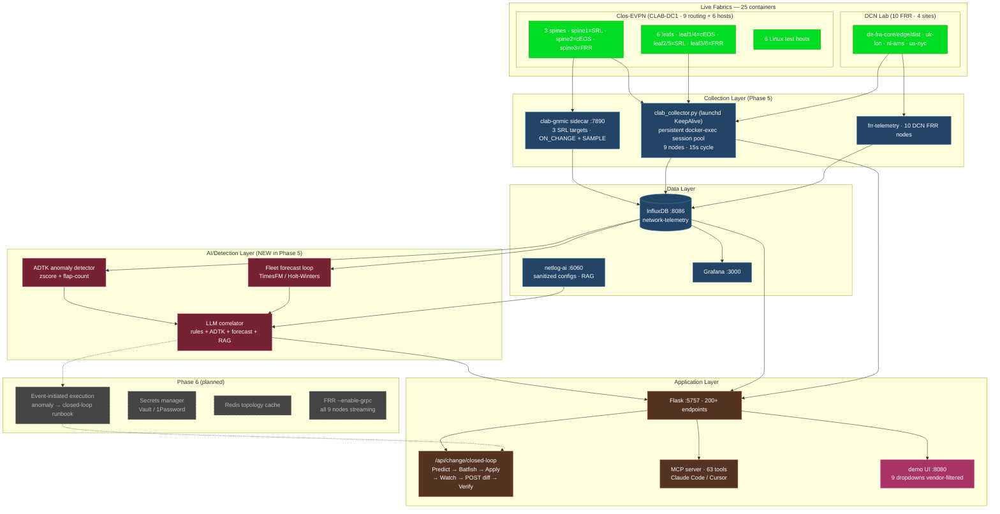

# Architecture — Phase 5 (End-of-Phase Snapshot, 2026-05-25)

This document is the post-Phase-5 reference architecture. It supersedes
`ARCHITECTURE_HARDENED.md` from the mid-Phase-5 audit and is the input
to Phase 6 planning.

## Stress-test evidence (run 2026-05-25 23:27)

**41 PASS · 0 FAIL** across every feature, every fabric, every vendor:

| Subsystem | Coverage |
| --- | --- |
| Inventory | 25 live containers · clab 9/9 healthy · 51/51 BGP |
| NAPALM | 16/16 across 4 sites × 4 endpoints (bgp-status, version-audit, env-health, interface-errors) |
| Nornir | 10/10 across 2 sites × 5 tasks (vendor-aware dispatch) |
| Closed-loop pipeline | dry-run + full apply both APPROVED |
| Chaos Monkey | both fabrics responsive (dcn=simulated, clab=live docker exec) |
| Shadow Auditor | 0 unreachable across all/clab-dc1/de-fra scans |
| Forecast (fleet) | 18 runs · 9 hosts × 2 metrics |
| ADTK anomaly | 2 detectors (zscore + flap) running |
| Correlate | 2 incidents from 4 raw alerts · knowledge_enriched_hosts=3 |
| gNMI | 3 SRL targets · all_fresh_under_30s=true |
| MCP server | 63 tools registered |
| Session pool | persistent docker exec sessions live |

## Top-level data flow

## Layer-by-layer

### Live Fabrics (unchanged in Phase 5 — verified)

| Site | Devices | Vendor mix |
| --- | --- | --- |
| DE-FRA / UK-LON / NL-AMS / US-NYC | 10 FRR routers | FRR 8.4 in docker-compose |
| CLAB-DC1 | 9 routing + 6 hosts | Nokia SRL · Arista cEOS · FRR (3+3+3) via containerlab |

Test hosts (host1-6) are excluded from every Nornir/Chaos/closed-loop run.

### Collection Layer

- **gnmic sidecar** (`clab-gnmic`) — 3 SR Linux targets via OpenConfig paths,
  ON_CHANGE for state events + 10 s SAMPLE for counters. Writes
  `intf-counters` / `bgp-session-state` / `intf-oper-state` measurements
  with `source` tag (gnmic-exclusive). Sub-second latency on state events.
- **clab_collector.py** — docker-exec based collector with vendor-specific
  command dispatch (vtysh / sr_cli / Cli). Under launchd KeepAlive
  supervision. **Phase 5 enhancement**: persistent shell session pool —
  one long-running `docker exec -i sh` per container, eliminates the
  per-call docker CLI startup overhead. Falls back to one-shot on session
  death.
- **frr-telemetry container** — polls all 10 DCN FRR routers via SSH every
  10 s. Writes `bgp_neighbor` / `interface_stats` / `bgp_sessions` measurements.

### Data Layer

| Service | Purpose |
| --- | --- |
| InfluxDB 2.7 | `network-telemetry` bucket — all metrics + tags |
| Grafana | 2 dashboards (DCN + clab) provisioned from `InfluxDB-FRR` datasource |
| netlog-ai | Sanitized per-device configs + compliance findings · RAG over configs |

### AI / Detection Layer (NEW in Phase 5)

| Component | Endpoint | Signal type |
| --- | --- | --- |
| ADTK detector | `GET/POST /api/anomaly/detect` | Z-score level shifts + flap-count cycles over BGP+intf series. Fires 5-30 min before binary thresholds trip. |
| Fleet forecast | `POST /api/mv/forecast/run-fleet` | Holt-Winters or TimesFM 128-step forecast across all 9 nodes × 2 metrics. Predictive alerts when P95 upper bound crosses threshold within horizon. |
| LLM correlator | `POST /api/keep/correlate` | LLM-based incident correlation — merges rule-based + ADTK + forecast alerts, enriches with netlog-ai compliance findings, deduplicates into incidents. |

### Application Layer

| Endpoint | What it does |
| --- | --- |
| `POST /api/change/closed-loop` | 6-stage governed change (Predict→Batfish→Apply→Watch→POST diff→Verify) with auto-rollback on regression |
| `GET /api/change/closed-loop/<id>` | Poll a change's phase + final verdict |
| `POST /api/napalm/{bgp,version,env,iface}` | Vendor-aware NAPALM-equivalent collection via docker exec (Juniper/EOS/SRL/FRR) |
| `POST /api/nornir/run` | Parallel multi-vendor task execution (bgp_health, version, lldp, config_compliance, …) |
| `POST /api/chaos/bgp` | BGP chaos injection on dcn (sim_bgp_failure.sh) or clab (live docker exec) |
| `POST /api/shadow/audit` | Compare NetBox SoT to live running-config (docker exec) for every device |
| `POST /api/anomaly/detect` | ADTK z-score + flap-count detectors |
| `POST /api/mv/forecast/run-fleet` | Fleet predictive forecast |
| `GET  /api/telemetry/gnmic-status` | gNMI sidecar health + per-target freshness |
| `GET  /api/mv/clab-status` | Live clab fabric BGP + interface state (15 s freshness) |

### MCP Server (Phase 5 expansion → 63 tools)

13 new tools added in Phase 5:

| Tool | Wraps |
| --- | --- |
| `mv_clab_status` | live clab fabric state |
| `mv_fabric_topology` | physical + overlay topology |
| `mv_gnmic_status` | streaming-telemetry freshness |
| `mv_knowledge_correlate` | LLM correlator with knowledge enrichment |
| `mv_anomaly_detect` | ADTK detector |
| `mv_forecast_fleet` + `mv_forecast_status` | predictive forecast |
| `mv_change_closed_loop` + `mv_change_status` + `mv_change_recent` | the closed-loop pipeline |
| `mv_chaos_bgp` | dual-fabric chaos |
| `mv_napalm_bgp` + `mv_napalm_job` | vendor-aware NAPALM |
| `mv_shadow_audit` | config-drift audit |

## Where we are on industry rubrics

| Rubric | Phase 4 score | Phase 5 score | Phase 6 target |
| --- | --- | --- | --- |
| Itential "Real vs Theater" (5 capabilities) | 3/5 | **5/5** (live state · multi-step plan · real API · governed execution · event-initiated still partial) | 5/5 with event-initiated auto-trigger |
| TM Forum ANL (IG1252) | L2 | **L3** | L4 (closed-loop self-optimization) |
| AI-SRE 5-Capability Test (Single Singh) | 3/5 | **5/5** (multi-step · tool exec · graph awareness · KB-RAG · structured RCA) | 5/5 |
| Aether (NDT) — Error Detection / Precision | n/a | structured RCA shipping; precision n/a (no labelled dataset yet) | establish eval set + measure |

## Phase 6 — what's next

Ordered by value/effort:

| # | Item | Effort | Why |
| --- | --- | --- | --- |
| 1 | **Event-initiated remediation** | 1 session | The last piece of the 5/5 AI-SRE rubric. Wire ADTK / forecast anomalies that exceed threshold → automatic `POST /api/change/closed-loop` invocation with a pre-built runbook payload. Human-approval gate via existing `approval_status` field. |
| 2 | **#2 follow-up execution — cEOS image swap + FRR gRPC build** | 1-2 sessions | Realises the migration documented in `docs/STREAMING_TELEMETRY_GAPS.md`. Brings all 9 clab routing nodes onto streaming. |
| 3 | **Eval corpus + regression suite** | 2 sessions | Per Aether — build a curated set of N "golden traces" (real anomalies + expected correlator outputs) so changes to the LLM correlator don't silently regress. |
| 4 | **Production NetBox-as-SoT wiring** | 2 sessions | The Shadow Auditor currently reads inventory.json. For a real deployment it should pull device list from NetBox API (or any IPAM) so the "fabrics" become operator-configurable. |
| 5 | **Secrets manager** | half session | Move `INFLUXDB_TOKEN` / SSH creds out of `.env` into Vault / 1Password / AWS Secrets Manager. Pre-CI hardening. |
| 6 | **Redis-backed shared cache** | half session | `_FABRIC_TOPOLOGY_CACHE` is per-process; Redis lets multiple Flask workers share. Required before any production multi-worker deployment. |
| 7 | **Postmortem + AI Insights real backends** | 1 session | Both UIs now have fabric selectors but the backends still produce mock data for some panels. Wire to real LLM-driven analysis of `keep/correlate` + GAIT events. |
| 8 | **Web-UI consolidation** | 2 sessions | `demo/index.html` is 200+ KB and 8 navigation tabs deep. Refactor into a tab-per-skill SPA or pull the heavy state into Vue/React components. |

## Documents in this folder

- [`POST_AUDIT_2026-05-25.md`](POST_AUDIT_2026-05-25.md) — initial audit, 9 fixes
- [`POST_AUDIT_FIXES_2.md`](POST_AUDIT_FIXES_2.md) — round-2 audit, 9 more fixes
- [`CHANGE_PIPELINE.md`](CHANGE_PIPELINE.md) — closed-loop pipeline reference
- [`STREAMING_TELEMETRY_GAPS.md`](STREAMING_TELEMETRY_GAPS.md) — cEOS / FRR migration
- [`ARCHITECTURE_HARDENED.md`](ARCHITECTURE_HARDENED.md) — mid-Phase-5 snapshot (superseded by this doc)
- [`ARCHITECTURE_PHASE_5.md`](ARCHITECTURE_PHASE_5.md) — **you are here** (Phase-5 end)
