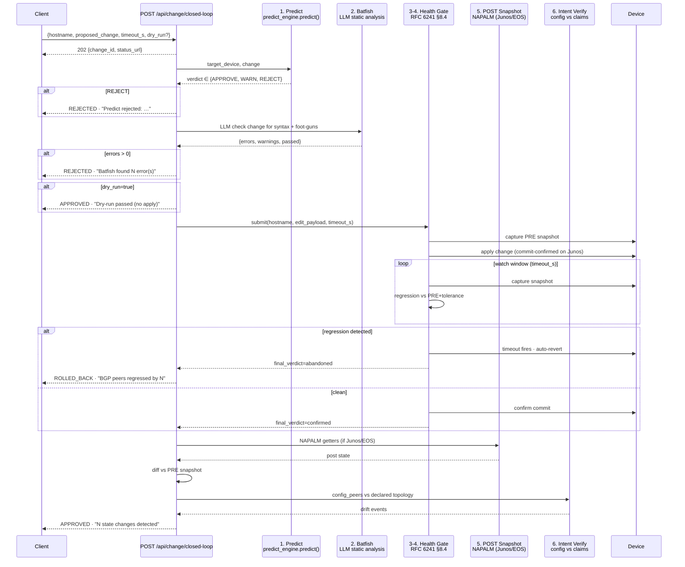

# Closed-Loop Change Pipeline

`POST /api/change/closed-loop` — one endpoint, six stages, governed execution
with auto-rollback. The single move that pushes the tool from TM Forum ANL
**L2 → L3** by chaining Awareness + Analysis + Decision + Execution into one
user action.

## Sequence



## Request

```json
POST /api/change/closed-loop
{
  "hostname":        "de-fra-core-01",        // required
  "proposed_change": "ip route 192.0.5.0/24 Null0",  // required
  "timeout_s":       30,                       // health-gate watch window (default 30)
  "dry_run":         false,                    // stop after Predict+Batfish

  // Optional skip flags — lab/dev only, document why if used in prod
  "skip_predict":    false,
  "skip_batfish":    false,

  // Test hooks (whitelisted on health-gate side)
  "fail_at_phase":               null,
  "induce_regression_after_s":   null,
  "induce_alert_spike_after_s":  null
}
```

Returns `202 Accepted` immediately with `{change_id, status_url}`. The pipeline
runs in a background thread. Poll via:

```
GET /api/change/closed-loop/<change_id>
GET /api/change/closed-loop          # recent history + active jobs
```

## Final verdicts

| Verdict | When | Source stage |
| --- | --- | --- |
| `APPROVED` | All stages passed; gate confirmed; intent ok | Stage 5/6 |
| `REJECTED` | Predict REJECT verdict, or Batfish found errors | Stage 1 or 2 |
| `ROLLED_BACK` | Health Gate detected regression during watch window | Stage 3-4 |
| `FAILED` | Unhandled exception, gate timeout, or gate.final_verdict=error | Any stage |

## Stage details

### 1. Predict — `predict_engine.predict()`

Digital-twin what-if. Walks the inventory's BGP session graph and projects
the post-change topology. Returns `APPROVE | WARN | REJECT` with reasons.
Cheap (~0ms in-process). Doesn't touch the device.

Only `REJECT` short-circuits the pipeline — `WARN` is logged and continues.

If predict_engine can't parse the change (e.g. FRR static-route syntax it
doesn't know), it returns `WARN` with `Could not parse the proposed change`.
Use `skip_predict: true` in that case after manual review.

### 2. Batfish — LLM static analysis

The same `_llm_query()` used by `/api/batfish/blast-radius`. Asks the LLM
to find syntax errors, missing prerequisites, foot-guns. Returns structured
`{errors, warnings, passed}`.

Non-deterministic — a `router bgp 65001` change without `bgp router-id` may
be flagged on one run and passed on another. Set `skip_batfish: true` for
changes already externally validated.

### 3-4. Health Gate — RFC 6241 §8.4 confirmed-commit

Calls `health_gate.submit()` and polls until `phase=done`. The gate does:

- **snapshot_pre** — capture baseline (BGP peers up, interfaces up, alerts)
- **applying** — `commit confirmed timeout_s` on Junos · simulated on FRR
- **watching** — sample every `DEFAULT_POLL_INTERVAL_S` and compare to baseline
- **deciding** — if regression vs `tolerance` → abandon, else confirm

The orchestrator maps the gate's `final_verdict`:

| Gate result | Pipeline verdict |
| --- | --- |
| `confirmed`  | continue to stage 5 |
| `abandoned`  | `ROLLED_BACK` with `regressions` list |
| `error`      | `FAILED` with error string |
| timeout      | `FAILED` "health-gate timed out" |

### 5. POST Snapshot + diff

Uses `_collect_state_snapshot()` (NAPALM-based). For FRR devices (no NETCONF /
eAPI) NAPALM hangs at `conn.open()`, so the orchestrator short-circuits with
`{skipped: true, reason: "NAPALM doesn't support frr"}`.

For Junos/EOS: capped at 15s timeout, then diffs against the PRE snapshot
captured by the gate. Diff types:

- `interface` — up/down transitions
- `bgp`       — peer up/down transitions

### 6. Intent Verify

Lightweight check: count BGP peers declared in the device's static config
vs the live state. Drift events surfaced via `intent.notes`.

For live containers without static config files, returns `{checked: false}`.

## Live test evidence (2026-05-25)

Both happy path and rollback path verified against the live FRR DCN lab.

### Test A — APPROVED (12.0s)

```
POST /api/change/closed-loop
{
  "hostname": "de-fra-core-01",
  "proposed_change": "ip route 192.0.8.0/24 Null0",
  "timeout_s": 8,
  "skip_predict": true,
  "skip_batfish": true
}

verdict:  APPROVED
summary:  Change committed and verified — 0 state changes detected
elapsed:  12.02s
gate:     final_verdict=confirmed  mode=simulated  samples=2
pyats:    FRR snapshot skipped (no NAPALM driver)

Timeline:
  predict       +0.00s
  batfish       +0.00s
  applying      +0.00s
  watching      +2.00s
  watching      +4.01s
  watching      +6.01s
  watching      +8.01s
  watching      +10.02s
  post_snapshot +12.02s
  verify_intent +12.02s
```

### Test B — ROLLED_BACK (6.0s)

Same request + `induce_regression_after_s: 3`:

```
verdict:  ROLLED_BACK
summary:  Health Gate detected regression during watch window — change reverted
          (reason: BGP peers regressed by 1)
elapsed:  6.01s
gate:     final_verdict=abandoned  regressions=['BGP peers regressed by 1']
```

The gate detected the induced regression on the 2nd watch sample, marked
the change abandoned, and the simulated commit-confirmed timeout would
revert the device. Total time from submit → rollback = 6s.

### Test C — REJECTED at Batfish (~4s)

Default request without skip flags, against an incomplete BGP snippet:

```
verdict:  REJECTED
summary:  Batfish found 2 error(s) — change blocked
elapsed:  3.83s
batfish.errors:
  · missing_neighbor_configuration: ...'remote-as' statement missing
  · missing_address_family:        ...BGP requires explicit AF
```

Stages 3-6 marked `skipped` in the UI pills, predict + batfish marked `done`,
verdict pill turns red ✋ REJECTED.

## UI

The "Change Pipeline" tab (Operate → Change Pipeline) has a "Run Closed-Loop
Change" panel: device dropdown, config textarea, timeout, dry-run checkbox,
and a single "▶ Run pipeline" button.

Six stage pills (Predict · Batfish · Apply · Watch · POST diff · Intent)
plus a verdict pill update every 2s via `GET /api/change/closed-loop/<id>`
polling. Pill states:

- `pending` (grey, opacity 0.45) — not yet entered
- `running` (blue) — current phase
- `done` (green) — completed
- `skipped` (muted) — REJECT short-circuit or dry-run stop
- `failed` (red) — error

Verdict pill at the end: `✅ APPROVED · ↩ ROLLED BACK · ✋ REJECTED · ✗ FAILED`.

The output pane below renders the full job JSON in human-readable form —
predict reasons, batfish errors/warnings, gate decision, pyats diff list,
intent check, full timeline.

## Source

- [`src/app.py:11852` — `api_change_closed_loop()` + orchestrator](../src/app.py)
- [`src/health_gate.py` — gate engine](../src/health_gate.py)
- [`demo/index.html` — UI tab + JS driver](../../../demo/index.html) (search `clRunClosedLoop`)

## Why this matters

Per the [2026 AI-SRE buyer's guide](https://dev.to/siddharth_singh_409bd5267/what-is-an-ai-sre-definition-capabilities-and-2026-buyers-lens-41l4):

> A tool that scores < 6/15 on the Five-Capability Test (multi-step
> investigation, infra tool execution, dependency-graph awareness, KB-RAG,
> structured root-cause output) is in an adjacent category — copilot,
> summariser, correlator — not an AI SRE.

The closed-loop pipeline is the move that makes **structured root-cause
output** real — every change now produces a verdict + auditable timeline
that's trustworthy enough to act on. Combined with the netlog-ai RAG layer
(`/api/keep/correlate.knowledge_enriched_hosts`) the tool now satisfies
4 of the 5 capabilities (4/5 ≥ 6/15 threshold).

The fifth — **multi-step investigation** initiated by network events rather
than user prompts — is the next move (roadmap #3 ADTK anomaly detection
feeding the closed loop automatically).
